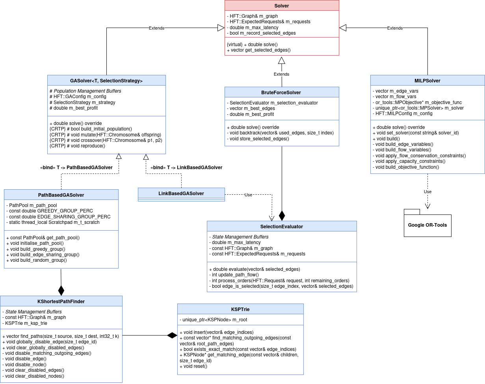
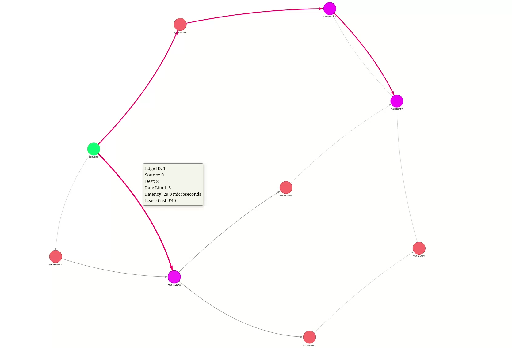

# hft-network-optimization

## Paper Title

Balancing Cost, Latency, and Capacity: Network Optimisation for High-Frequency Trading

## Abstract

This work studies a High-Frequency Trading Network Design Problem (HFT-NDP), where a trading firm must decide which cross-connects to lease between its servers and colocated exchanges in order to route orders with minimal latency, therefore maximising returns. Orders may be sent either directly to an exchange or indirectly via other exchanges, subject to latency-dependent profit and rate-limit constraints on each link. We formulate this task as a Fixed-Charge Capacitated Network Design Problem (FCCNDP) with separable commodity flows, which is NP-Hard. To address the resulting computational challenges, we develop a suite of exact and metaheuristic approaches, including two Genetic Algorithm (GA) formulations. We utilise OpenMP to allow for scalable exploration of the solution space through the use of parallelisation. Alongside this, we formulate the problem as a Mixed-Integer Linear Program (MILP) and solve it using various open-source solvers including SCIP, CBC, HiGHS, and CP-SAT, all of which are available in the Google OR-Tools C++ library. Empirical evaluation demonstrates that these approaches, particularly the Path-Based GA, efficiently produce high-quality solutions for large network instances where exact optimisation is computationally intractable.

## System Architecture



## Reproducing Research Results

This repository contains the implementation of the Genetic Algorithm and MILP solvers used in the dissertation. To ensure bit-for-bit reproducibility of the results presented, follow the environment and build specifications below.

### 1. System Requirements
The benchmarks in the paper were conducted on an **Intel i9-9900k** (8-core/16-thread). Because the parallel search path is tied to hardware concurrency, running these tests on a system with a different core count will result in a different, though statistically equivalent, convergence path.

* **OS:** Ubuntu 24.04.4 LTS
* **Compiler:** GCC 13.3+
* **C++ Version:** C++20 or newer
* **Dependencies:** CMake 3.28.3+, OpenMP, Google Benchmark, Google Test

### 2. Build Instructions

```bash
# Check out the repo
> git clone https://github.com/Tarrin376/hft-network-optimization.git
# Go to the root directory
> cd hft-network-optimization
# Create build directory
> mkdir build
# Build in Release Mode mode to enable the optimisations used during the performance evaluation
> cmake -S . -B build -DBUILD_DEPS:BOOL=ON -DCMAKE_BUILD_TYPE=Release
# Build the repo
> cmake --build build -j<num_processes>
# Enforce thread affinity (recommended for systems with Hyper-Threading)
> export OMP_PROC_BIND=true
```

### 3. Running The Benchmarks
```bash
# Check out the build directory
> cd build
# Run the 'bench' executable to run benchmarks
> ./bench
```

## CLI Usage Guide

The solver provides a Command Line Interface (CLI) to configure the solvers and environmental parameters. Note that all file paths are relative to the `../data_files/` directory.

### Configuration Flags

Below is the complete list of available flags. When providing a file name, ensure that the file is present in the `../data_files/` directory.

#### Input/Output Parameters
*   `--nodes`, `-n`  
    **Type:** String  
    The filename for the nodes input (CSV).
*   `--edges`, `-e`  
    **Type:** String  
    The filename for the edges input (CSV).
*   `--requests`, `-r`  
    **Type:** String  
    The filename for the expected order opportunity requests (CSV).
*   `--record`  
    **Type:** String  
    The filename used to output and record the selected leased edges.

#### Solver & Environment Settings
*   `--algorithm`, `-a`  
    **Type:** String  
    Specifies the solver to use. Options are `brute-force`, `link-based-ga`, `path-based-ga`, and `milp`.
*   `--maxlatency`, `-l`  
    **Type:** Double  
    The maximum permissible latency for any path in the solution.
*   `--seed`  
    **Type:** Unsigned Long Long  
    The seed value for the PRNG to ensure reproducibility of results.

#### Genetic Algorithm (GA) Hyperparameters
*   `--population`  
    **Type:** Integer  
    The total number of individuals in the population for each generation.
*   `--generations`  
    **Type:** Integer  
    The maximum number of generations the algorithm will run.
*   `--mutation`  
    **Type:** Double  
    The probability (0.0 - 1.0) of a mutation occurring during offspring generation.
*   `--crossover`  
    **Type:** Double  
    The probability (0.0 - 1.0) of a crossover occurring between parents.

#### Link-Based GA Parameters
*   `--initial-bit-flip-rate`  
    **Type:** Double  
    The bit flip rate (0.0 - 1.0) used when constructing the initial population.

#### Path-Based GA Parameters
`--num-shortest-paths`  
    **Type:** Integer  
    The number of shortest paths ($k$) to be precomputed for each request.

#### MILP Settings
*   `--solver-id`  
    **Type:** String  
    The identifier for the specific MILP solver. Options are `SCIP`, `CP-SAT`, `HiGHS`, and `CBC`.

---

### Example Commands
```bash
# Running Path-Based GA
./HFT -n test_nodes.csv -e test_edges.csv -r test_requests.csv \
      --algorithm path-based-ga \
      --population 100 \
      --generations 500 \
      --num-shortest-paths 40 \
      --maxlatency 70

# Running Link-Based GA
./HFT -n test_nodes.csv -e test_edges.csv -r test_requests.csv \
      --algorithm link-based-ga \
      --population 100 \
      --generations 500 \
      --initial-bit-flip-rate 0.09 \
      --maxlatency 70

# Running SCIP MILP Solver
./HFT -n test_nodes.csv -e test_edges.csv -r test_requests.csv \
      --algorithm milp \
      --solver-id SCIP \
      --maxlatency 70
```

## Input File Formats (CSV)

To construct custom network topologies, follow the CSV structures outlined below. All files should be placed in the `../data_files/` directory.

### 1. Nodes File (`--nodes` / `-n`)
This file defines the vertices in the network and identifies which nodes act as servers or exchanges.

| Column | Description |
| :--- | :--- |
| `NodeId` | Unique integer identifier for the node. |
| `IsServer` | Boolean-style integer (`1` for Server, `0` for Exchange). |

**Example (`nodes.csv`):**
```csv
NodeId,IsServer
0,1
1,0
2,0
3,0
4,0
5,0
6,0
7,0
8,0
```

### 2. Edges File (`--edges` / `-e`)
This file defines the directed links between nodes, their constraints, and their costs.

| Column | Description |
| :--- | :--- |
| `Source` | Starting `NodeId`. |
| `Dest` | Ending `NodeId`. |
| `RateLimit` | Maximum number of orders per unit of time that can pass this link. |
| `Latency` | The time delay (in microseconds) for orders to traverse the link. |
| `LeaseCost` | The fixed financial cost to "activate" or lease this edge. |

**Example (`edges.csv`):**
```csv
Source,Dest,RateLimit,Latency,LeaseCost
0,5,9,75,170
0,8,3,29,40
0,6,5,39,130
6,7,8,41,60
7,3,6,17,20
3,7,6,19,15
8,1,2,26,15
5,8,3,50,70
8,4,1,20,30
4,3,1,20,30
1,2,2,18,27
2,3,2,15,32
```

### 3. Requests File (`--requests` / `-r`)
This file defines the expected order opportunities that must be routed from servers to specific destination exchanges.

| Column | Description |
| :--- | :--- |
| `Server` | The origin `NodeId` (must have `IsServer=1` in the nodes file). |
| `Exchange` | The destination `NodeId` (must have `IsServer=0` in the nodes file). |
| `NumOrders` | Total number of orders to be transmitted. |
| `PlanningHorizon` | The time window available for transmission. |
| `MaxOrderProfit` | The maximum profit possible if an order is routed in 0 microseconds. |

**Example (`requests.csv`):**
```csv
Server,Exchange,NumOrders,PlanningHorizon,MaxOrderProfit
0,3,3,1,390
0,7,11,24,450
0,8,13,20,700
```

## Network Visualiser

The project includes a Python-based visualiser that generates an interactive HTML graph. This tool highlights the leased edges in pink while showing the rest of the network in grey.

### Setup Instructions
```bash
# Move into the `scripts` directory
> cd scripts
# Create a virtual environment using virtualenv
> virtualenv <virtual env name>
# Activate the virtual environment (Linux)
> source ./venv/bin/activate
# Install required dependencies from `requirements.txt`
> pip install -r requirements.txt
# Run the visualiser, specifying the nodes, edges, requests, and answer CSV files
> python graph_visualisation.py -n test_nodes -e test_edges -r test_requests -a test_answer
# Open the generated `network.html` file
> open ./network.html
```

### Graph Visualisation Example of Test Graph

